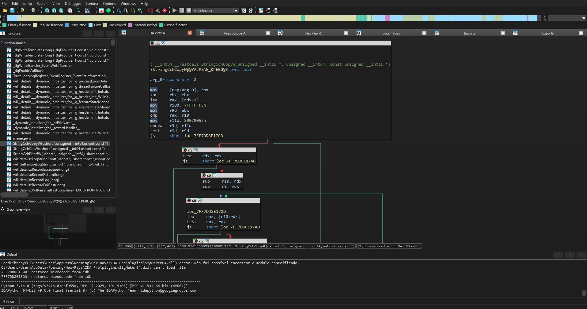

# CNT IDA Theme

A dark theme for IDA Pro

## How does it work?

The theme changes the colors of disassembly, pseudocode, and syntax highlighting. Install it and select it from IDA's themes menu.

## Demo

## Installation

Copy the `cnt-ida-theme` folder into IDA's `themes` directory.

Then go to **Options → Themes → cnt-ida-theme → OK**.

This is my personal theme, made for my own use and shared with the community. If it helps with your workflow, feel free to use it.
